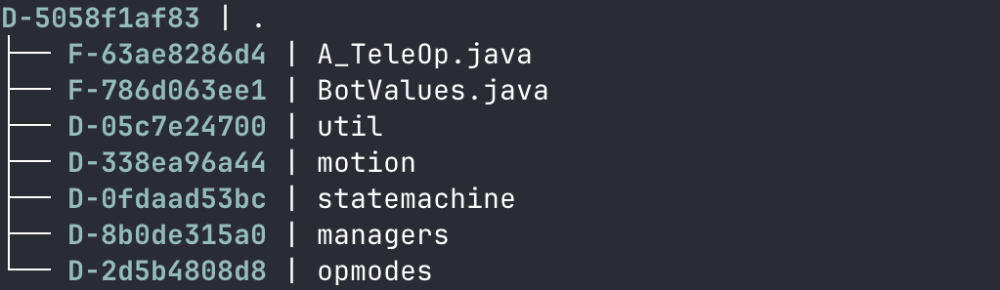
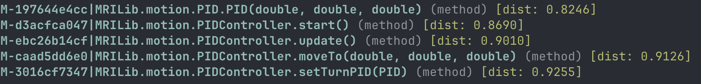
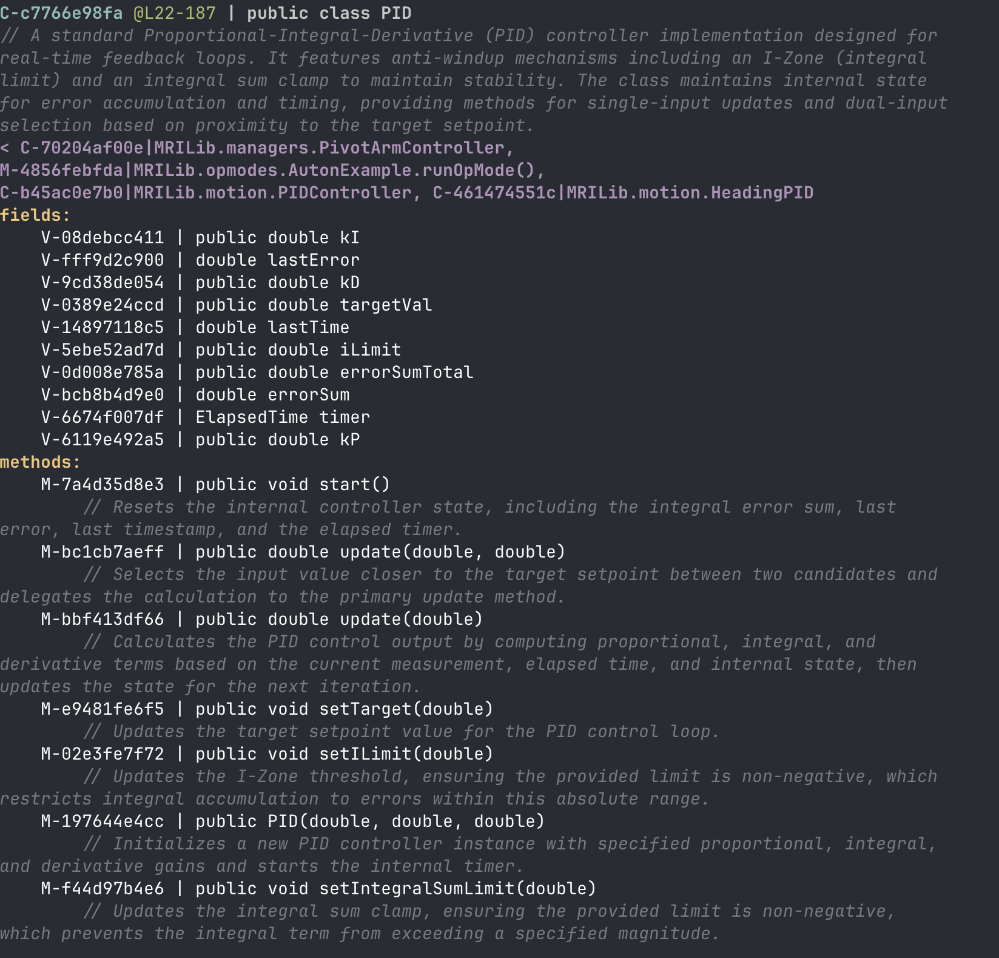
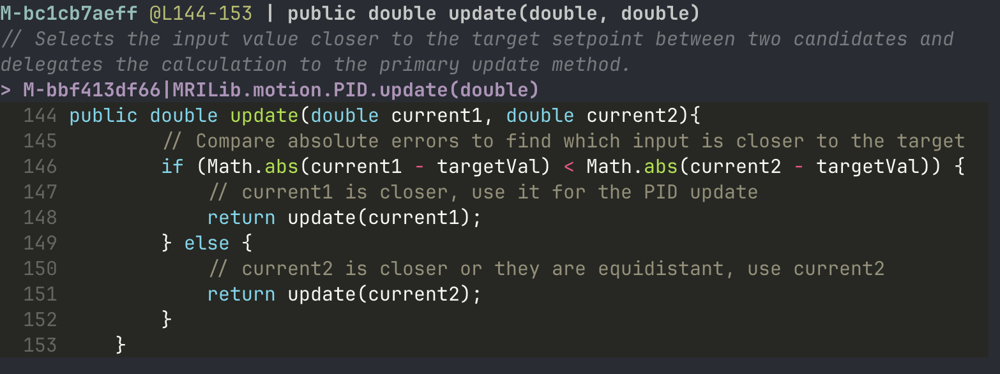

<p align="center">
    <a href="https://tostr.ai/"></a>
</p>

<h1 align="center">
Frontloading Agentic AI Code Context
</h1>

<p align="center">
    
</p>

<p align="center">
Tostr is a CLI and MCP agent context engine which greatly reduces token costs and context bloat for agentic LLM coding assistants by pre-computing an llm-described AST with outputs in the highly-efficient .tost format.
</p>

# Features
### 🌴 Pre-computed Abstract Syntax Tree
Tostr scrapes your project on initialization, building a comprehensive Abstract Syntax Tree IR (Intermediate Representation) of the entire OOP code structure and stores it in a local SQLite database.

### ⛓️ Heuristic Dependency Graph Resolution
Tostr resolves dependencies between structures in your code, building a dependency graph to allow agents to traverse inbound or outbound method calls efficiently.

### 🔌 MCP and CLI interfaces
Tostr has both a CLI and MCP interface, allowing llms to boot up the mcp server for larger development sessions, while allowing agents or human developers to utilize the CLI for individual actions or quick, manual AST traversals.

### ⛓️‍💥 Automatic Incremental Change Diffs
While the MCP server is running, Tostr identifies the subtree of the AST which was updated on file save, add, or delete, then re-scrapes and re-describes exactly the section that was updated, ensuring that the AST is instantly up-to-date during development.

### 🗄️ Lightweight SQLite Cache
The AST IR and Dependency Graph is cached to an on-drive SQLite .db file to vastly increase efficiency of agent AST traversals, as well as allow the AST to be directly queried via sql commands.

### 💭 Semantic Vector Embedding 
Using local ONNX (Open Neural Network Exchange) weights from the all-MiniLM-L6-v2 embedding model, Tostr embeds the descriptions of each struct, allowing for far more accurate semantic search of specific structs than the traditional line blocking approach.

## 🌍 Language Support Matrix

Tostr is designed to map the macro-architecture of your codebase. While all supported languages receive high-density **Structural AST Skeletons** and **AI Semantic Descriptions**, multi-hop cross-file dependency resolution is currently optimized specifically for deep backend monoliths (Java). 

| Language | Structural AST Parsing | AI Semantic Descriptions | Cross-File Dependency Graph |
| :--- | :---: | :---: | :---: |
| **☕ Java** | ✅ | ✅ | ✅ |
| **🐍 Python** | ✅ | ✅ | ✅ |
| **🔷 TypeScript** | 🚧 Coming Soon | 🚧 Coming Soon | 🚧 Coming Soon |
| **🎯 C#** | 🚧 Coming Soon | 🚧 Coming Soon | 🚧 Coming Soon |
| **🐹 Go** | 🚧 Coming Soon | 🚧 Coming Soon | 🚧 Coming Soon |

*Tostr is still in active development, so this list will quickly expand and grow with more language support. If you want to add support for your favorite language, you can also take a look at [CONTRIBUTING.md](https://github.com/rubyTanuki/tostr/blob/main/CONTRIBUTING.md) to help us out!*

> **Note for AI Agents:** For languages where dependency tracking is marked "Coming Soon," the MCP server will cleanly omit the dependency fields. Agents should rely on `tostr skeleton` and semantic `search` to navigate these codebases.


# Getting Started

## Prerequisites
* Requires Python 3.12+
* Requires a Google Gemini API Key for descriptions

## Installation
Tostr is available on PyPI and can be installed via `pip` or `pipx`. Due to its dependencies, it is **highly recommended** to install it using `pipx` to keep it in an isolated environment:

```bash
pipx install tostr
```
> If you don't have pipx, you can download it easily via `brew install pipx` on mac or `python -m pip install --user pipx` on windows.

Alternatively, you can install it via standard `pip`:
```bash
pip install tostr
```

If you wish to utilize tostr's struct descriptions, you will also need to configure a Google Gemini API key and save it as an environment variable. This is optional, as the embedding will just fall back to using code bodies and UIDs when a description isnt generated.

To create a new API key:
1. Go to the [Google AI Studio](https://aistudio.google.com/) and log in with your google email.
2. Once logged in, in the bottom left click the `Get API Key` button.
3. In the top right, click `Create API Key`. You may need to create a new project before making an API key. You can just name it `tostr`
4. Name the key something like `Tostr API Key`. This name does not matter for the rest of the steps.
5. Click the button next to the new key that says `copy API key` to copy the string to your clipboard. It should be a long random string with 39 characters.
6. Save this key as an environment variable called `GEMINI_API_KEY` on your computer.

**DISCLAIMER**: While tostr does not use any gemini features that require a payment method, you will very quickly hit rate limits on a free tier. 

I would suggest setting up a payment method in the Google AI Studio so you can get the limits of the Tier 1 payment tier. Once set up, using tostr should cost only a couple cents per project if anything, since it uses the `Gemini Flash-Lite` model for all its description generation. You can very easily set a spend limit in Google's UI if you like by going to the `Spend` tab after creating your key.

#### Installing Environment Variables on Mac:
To expose your API key to tostr in a specific terminal session, run this command:
```bash
export GEMINI_API_KEY=[your api key]
```
> This will only save the key in the current session. To save the key permanently and system-wide, follow the instructions [here](https://www.youtube.com/watch?v=nfcAcfpeQ0Q)

#### Installing Environment Variables on Windows:
In order to save environment variables on Windows, follow these steps.

1. Press the windows key and type `environment variables`
2. Click `Edit the system environment variables` to open the System Properties window.
3. Click the `Environment Variables...` button at the bottom right.
4. Decide where to store your variable.
    * **User variables**: Only accessible by your specific Windows account.
    * **System variables**: Accessible by all users on the computer (requires Administrator privileges).
5. Click `New...` under the chosen section
6. Enter `GEMINI_API_KEY` in the name, and paste your API key from the Google AI Studio
7. Click OK on all open windows to save the settings.
> Note: You must restart any open command prompts for them to recognize the new variable.

## Connecting the MCP to your agent

Tostr can be used as an MCP (Model Context Protocol) server, allowing your favorite AI coding agent to interact directly with your project's AST and dependency graph.

### Generic Configuration
Most MCP-compatible agents use a JSON configuration file. You can generally add Tostr by adding the following to your `mcpServers` configuration:

```json
{
  "mcpServers": {
    "tostr": {
      "command": "tostr",
      "args": ["start-mcp"],
      "env": {
        "GEMINI_API_KEY": "YOUR_API_KEY_HERE"
      }
    }
  }
}
```

> **Note**: If `tostr` is not in your system PATH, you may need to provide the absolute path to the executable (e.g., `/Users/YOUR_NAME/.local/bin/tostr`). You can find this path by running `which tostr` on macOS/Linux or `where tostr` on Windows.

### Popular Agents with MCP Support
Below are instructions and links for setting up MCP servers in common AI coding environments:

*   **Claude Desktop**: [Official Setup Guide](https://modelcontextprotocol.io/quickstart/user)
*   **Cursor**: [Cursor MCP Documentation](https://docs.cursor.com/mcp)
*   **Cline (VS Code)**: [Cline Documentation](https://docs.cline.bot/mcp/mcp-overview)
*   **Codex**: [Codex Documentation](https://developers.openai.com/codex/mcp)

## Initializing Tostr
Before being able to use Tostr, the repository must be initialized using the CLI or MCP.

To manually initialize the repository, `cd` to the root of the project in a terminal window and run:
```
tostr init .
```
This creates the `.tostr` directory and initializes the default `.tostrignore` to exclude environment files, node_modules, build artifacts, and other files which are not needed in the project AST based on the desired language. It also creates a `config.toml` in your project's `.tostr/` directory, storing the projects configurations. Currently this is only the language, but more will be configured here in the future.

The `--language` flag is optional. If none is provided, tostr will parse each file which has a supported file extension, treating them all as valid dependency nodes. If you choose a specific language extension, only that extension will be parsed. Also, if no language extension is explicitly chosen, the .tostrignore will be initialized with a default, agnostic ignore file.

> Tostr currently only supports .java and .py, so the options for --language are 'java', 'py'.

If you are running tostr on a project that already has an existing database but you want to reparse from the start, use the `--no-cache` flag.

**Available Flags**:
- `--use-cache`, `--no-cache`: Load the existing cache if it exists (use `--no-cache` to force a full reparse from scratch). Default is `True`
- `--language`, `-l`: Restrict parsing to one language (e.g., `java`, `python`). Omit to auto-detect and parse all supported languages by extension. Default is `auto`
- `--no-llm`: Skip LLM-generated descriptions (no API key required). Embeddings fall back to code context. Default is `False`
- `--debug`, `--no-debug` / `-d`, `-nd`: Enable debug logging. Default is `False`

## Traversing the graph
Once the project is initialized, Tostr is ready to go! The CLI provides a rich, interactive way to explore your project's structure.

### Project Skeleton
To see the high-level structure of your project, run:
```
tostr skeleton . --depth 1
```
Tostr will print a beautiful tree structure of your root and its direct children.



**Available Flags**:
- `--pretty`, `--raw`: Pretty format output with line wrapping and indentation (disable for raw output). Default is `True`
- `--depth`, `-d`: Depth to traverse for skeleton generation. Default is `4`
- `--files-only`, `-f`: Only generate the skeleton for files, skipping individual classes/methods. Default is `False`
- `--max-lines`, `-m`: Maximum number of lines to include in the output. Default is `500`
- `--debug`, `--no-debug`: Enable debug logging. Default is `False`

### Searching Structs
You can search for specific code components using semantic natural language queries:
```
tostr search "PID controller"
```


**Available Flags**:
- `--filter`, `-f`: Filter results by struct type (e.g., `class`, `method`). Default is none (no filter)
- `--top-k`, `-k`: Number of results to return. Default is `5`
- `--debug`, `--no-debug`: Enable debug logging. Default is `False`

### Inspecting Structs
Each struct (file, class, method, or field) can be inspected for deep detail, including its LLM-generated description and dependency graph:

```
tostr inspect C-c7766e98fa .
```



```
tostr inspect M-bc1cb7aeff --body .
```


**Available Flags**:
- `--body`, `--no-body`: Attach the syntax-highlighted source code of the struct being inspected. Default is `False`
- `--pretty`, `--raw`: Pretty format output with line wrapping and indentation (disable for raw output). Default is `True`
- `--max-lines`, `-m`: Maximum number of lines to include in the output (useful for large classes). Default is `500`
- `--debug`, `--no-debug`: Enable debug logging. Default is `False`


## Other Commands

Beyond traversing the graph, Tostr provides a handful of commands for managing the database, keeping it in sync, and running the MCP server. Every command accepts an optional `path` argument (defaulting to the current directory `.`) pointing at the project root, and every command supports `--debug` / `--no-debug` (`-d` / `-nd`) to enable debug logging.

### `tostr status`
Show whether Tostr has been initialized in a project, along with the database location, size, last-updated time, and per-type struct counts.
```
tostr status .
```
**Available Flags**:
- `--debug`, `--no-debug` / `-d`, `-nd`: Enable debug logging. Default is `False`

### `tostr watch`
Watch the project for file changes and incrementally update the SQLite database as you save, add, or delete files. This runs in the foreground until interrupted (the MCP server performs the same incremental diffing automatically while running).
```
tostr watch .
```
**Available Flags**:
- `--debug`, `--no-debug` / `-d`, `-nd`: Enable debug logging. Default is `False`

### `tostr clean`
Clean (wipe) the SQLite database for a project, removing the cached AST and dependency graph. Useful before a fresh `init` or to reclaim space.
```
tostr clean .
```
**Available Flags**:
- `--debug`, `--no-debug` / `-d`, `-nd`: Enable debug logging. Default is `False`

### `tostr start-mcp`
Start the bare MCP server, which then awaits agent initialization over the Model Context Protocol. This is the command referenced in the [MCP configuration](#connecting-the-mcp-to-your-agent) above; you generally won't run it manually, as your agent launches it for you.
```
tostr start-mcp
```
This command takes no flags.

### Contributing to Tostr

See [CONTRIBUTING.md](https://github.com/rubyTanuki/tostr/blob/main/CONTRIBUTING.md) for instructions on how to contribute to the Tostr source code
